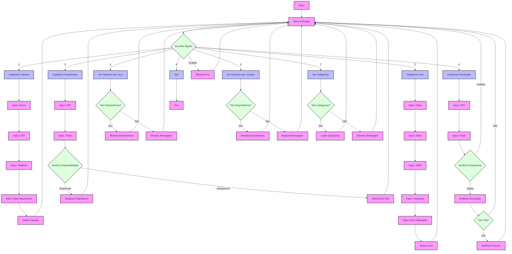

# Sistema Biblioteca SENAI - Fluxograma Detalhado

Este fluxograma representa o funcionamento completo do Sistema de Biblioteca SENAI, incluindo:

1. **Cadastros Básicos**
   - Cadastro de Usuários
   - Cadastro de Livros

2. **Sistema de Empréstimos**
   - Verificação de disponibilidade
   - Sistema de fila de espera
   - Notificação automática

3. **Sistema de Devoluções**
   - Verificação de empréstimo
   - Processamento da fila de espera
   - Notificação do próximo usuário

4. **Consultas e Relatórios**
   - Histórico por livro
   - Histórico por usuário
   - Lista de categorias

5. **Controle de Fluxo**
   - Validações
   - Mensagens de erro
   - Retorno ao menu principal 