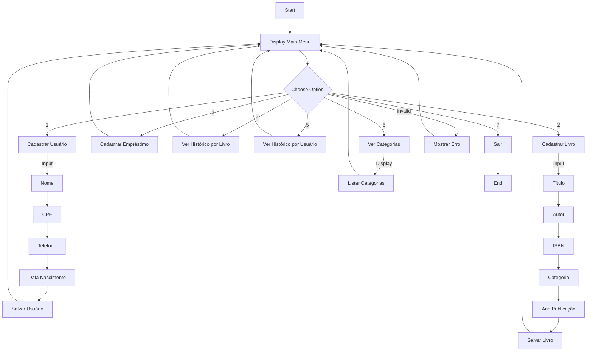

# Sistema Biblioteca SENAI - Fluxograma do Sistema

Este fluxograma representa o funcionamento básico do Sistema de Biblioteca SENAI, mostrando as principais operações e fluxos de dados disponíveis no menu principal.

## Descrição do Fluxo

1. O sistema inicia mostrando o menu principal
2. O usuário pode escolher entre 7 opções diferentes:
   - Cadastrar um Usuário
   - Cadastrar um Livro
   - Cadastrar um Empréstimo
   - Ver Histórico de Empréstimos por Livro
   - Ver Histórico de Empréstimo por Usuário
   - Ver Categorias de Livros
   - Sair do Sistema

3. Cada opção leva a um fluxo específico que, após completado, retorna ao menu principal
4. O sistema continua em execução até que a opção de sair seja selecionada 